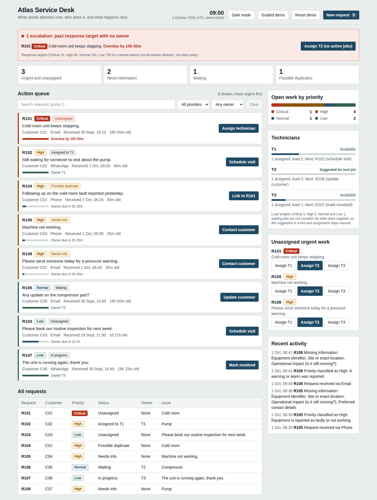
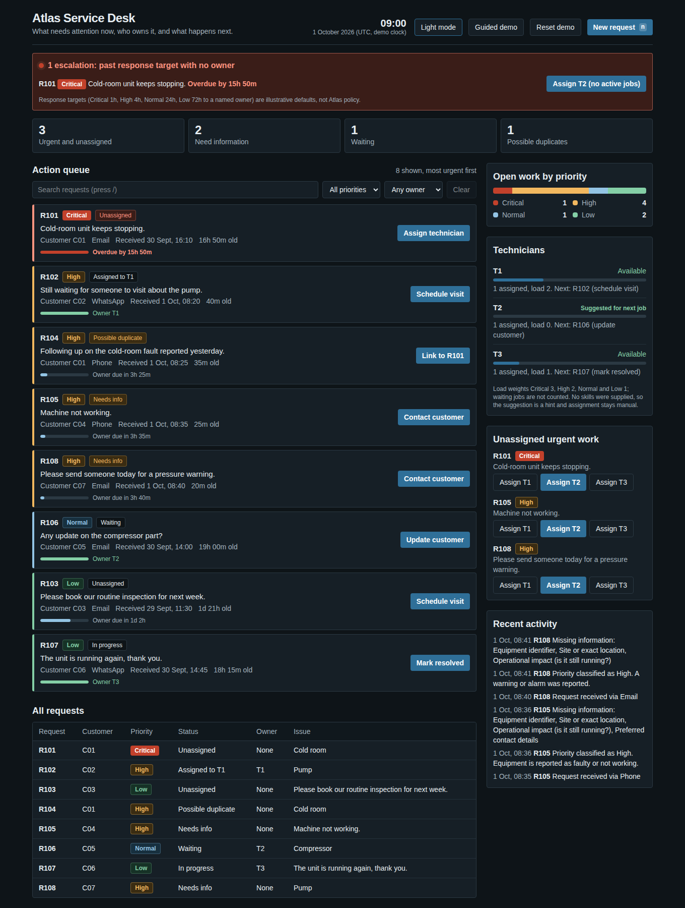
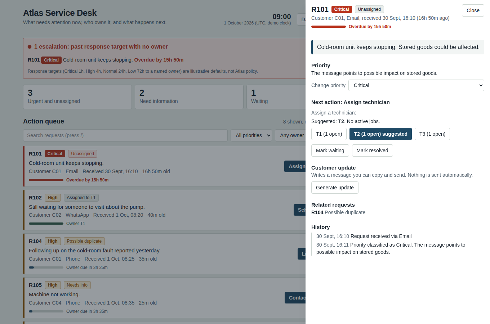
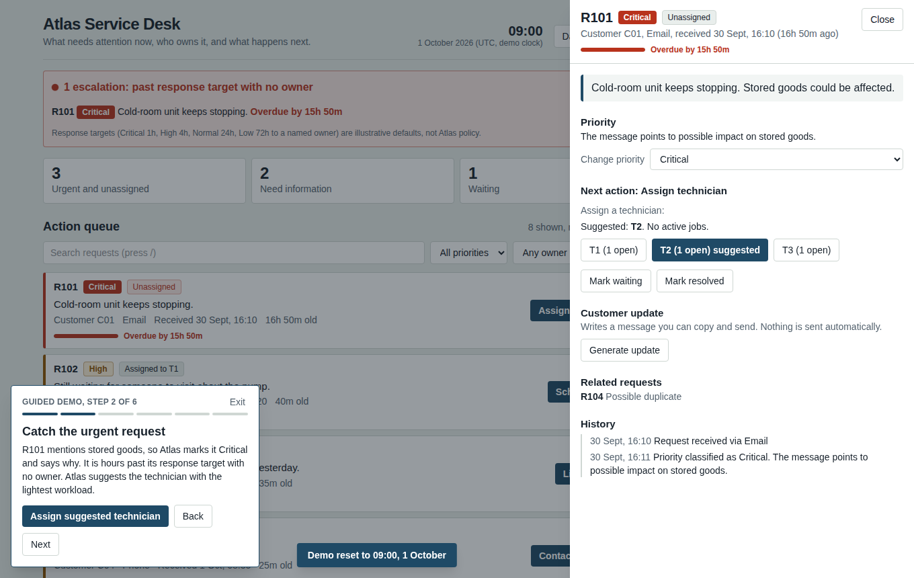
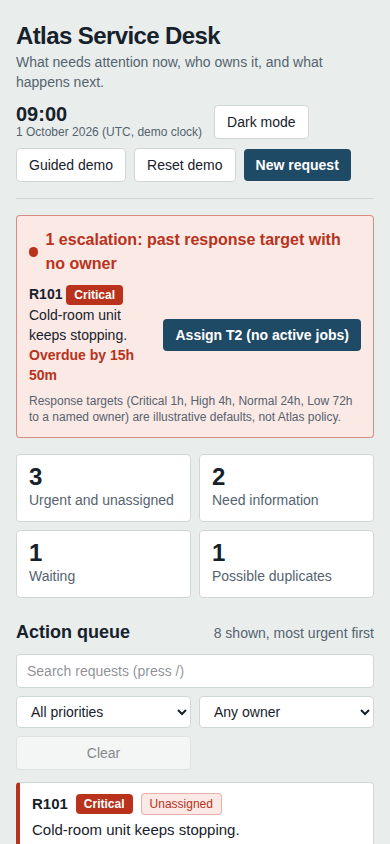

# Atlas Service Desk

A small **service request control center** that turns messy incoming requests into an actionable queue.

It answers one question: **what needs attention right now, who owns it, and what should happen next?**

It is deliberately not a full field-service management system. There is one dashboard, one request drawer, one intake form and a small backend.

## Screenshots



| Dark mode | Request drawer | Guided demo | Mobile |
| --- | --- | --- | --- |
| [](docs/screenshots/dashboard-dark.png) | [](docs/screenshots/request-drawer.png) | [](docs/screenshots/guided-demo.png) | [](docs/screenshots/mobile.png) |

## What it does

- **Action queue**: open requests sorted by priority then age, each with a single suggested next action.
- **Explainable priority**: simple keyword rules assign Critical, High, Normal or Low, and the reason is shown (for example "The message points to possible impact on stored goods").
- **Duplicate detection**: same customer, same issue type, within 48 hours of an earlier open request. It is a suggestion; the coordinator links it or keeps it separate.
- **Missing information**: vague fault reports list what is missing (equipment, location, operational impact, contact details).
- **Technician view**: who is assigned to what, plus one-click assign for unassigned urgent work.
- **Customer updates**: generates a message to copy and send. Nothing is sent automatically.
- **Audit trail**: every action writes a timestamped event to the request history.
- **Intake form**: simulates an incoming email, WhatsApp or phone message and previews the triage result as you type.
- **Response targets and ageing**: each unowned request shows a progress bar against an illustrative target (Critical 1h, High 4h, Normal 24h, Low 72h to a named owner). The clock stops when a technician is assigned.
- **Escalation alerts**: a banner lists Critical and High requests that are past target with no owner, with a one-click assign to the suggested technician.
- **Workload balancing**: technician load is weighted by priority (Critical 3, High 2, Normal and Low 1, waiting jobs not counted). The lightest-loaded technician is suggested, never auto-assigned.
- **Search and filters**: free-text search over ID, customer, channel, message, owner and status, plus priority and owner filters. Shortcuts: `/` focuses search, `n` opens a new request.
- **Visual polish**: dark mode (follows your system, with a toggle that remembers your choice), a mobile layout, a priority-mix bar, technician workload bars, subtle motion that respects reduced-motion settings, and confirmation toasts.

## Run it

Requires Node.js 20 or newer.

```bash
npm install
cp .env.example .env
npm run setup      # creates the SQLite database and seeds R101 to R108
npm run dev        # http://localhost:3000
```

Other commands:

```bash
npm test           # triage rules and service layer
npm run typecheck
npm run lint
npm run db:seed    # reset to the 09:00, 1 October 2026 starting state
```

The **Reset demo** button in the header does the same as `db:seed`.

If you change `DATABASE_URL` in `.env`, the Next.js app picks it up, but the Prisma CLI and `db:seed` default to `file:./dev.db`, so pass the variable on the command line too.

## Three minute demo

Click **Guided demo** in the header. It resets to 09:00, narrates each scene and has a button that performs the step for you. Or follow the same steps by hand:

1. **09:00 on 1 October.** Open the dashboard. Eight requests, three urgent and unassigned.
2. **Urgent request.** Open R101 (Critical, stored goods at risk). Assign T1. The queue, technician panel and history update.
3. **Duplicate.** Open R104. Atlas says it is a possible duplicate of R101 (same customer, same issue, 16h 15m later). Link it so there is one job, not two.
4. **Customer waiting.** Open R102 (assigned to T1, no visit time). Schedule a visit, then generate the customer update.
5. **Incomplete request.** Open R105 ("Machine not working. Please call us."). Atlas lists the four missing details.

Then click **New request**, choose "Urgent fault", and watch the preview triage it before you create it.

## Assumptions

These are stated on purpose; none of them are supplied Atlas policy.

| Area | Assumption |
| --- | --- |
| Assessment time | 09:00 on 1 October 2026. The app uses a demo clock that moves forward two minutes per action. Set `USE_REAL_CLOCK=true` to use real time. |
| Time zone | None was supplied, so times are shown in UTC. |
| Technicians | T1, T2 and T3 are available. No skill matrix or workload limits were supplied, so assignment is manual and the app does not claim skill-based optimisation. |
| Priority | Keyword rules in `src/lib/triage.ts`. Potential stock loss, safety issues and shutdowns rank above routine maintenance. Illustrative and easy to edit. |
| Service targets | No SLA was supplied, so the app never says "SLA breached". The targets in `src/lib/targets.ts` are illustrative defaults for time to a named owner, and the UI says "overdue against target". |
| Workload | Weights are illustrative. No skills, locations or capacity limits were supplied, so the suggestion is a hint and assignment stays manual. |
| Channels | Email, WhatsApp and phone are simulated through seeded records and the intake form. |
| Customers | C01 to C07 are the identifiers from the brief. |
| Duplicates | Suggestions only. A coordinator confirms. |
| Seed messages | Request IDs, customers and situations follow the brief. The exact wording of each message in `src/lib/demo.ts` is reconstructed to match, so replace it with the brief's text if it differs. |

## How it is built

The reasoning behind these choices, and what they trade away, is in [docs/DECISIONS.md](docs/DECISIONS.md).


- Next.js (App Router, server actions), TypeScript, Tailwind CSS
- Prisma 7 with SQLite through the better-sqlite3 driver adapter, so nothing is needed besides Node
- No AI or external services. Triage is deterministic, so every decision is explainable.

```
prisma/schema.prisma       Customer, Technician, Request, RequestEvent
prisma/seed.ts             Seeds the assessment scenario
src/lib/triage.ts          Priority, category, missing info and duplicate rules (pure)
src/lib/view.ts            Status labels, next actions, search, technician suggestion (pure)
src/lib/targets.ts         Response targets and escalation rules (pure)
src/lib/service.ts         Data operations, each writing an audit event
src/lib/demo.ts            Seed data for R101 to R108
src/app/actions.ts         Server actions used by the UI
src/components/            Board, RequestDrawer, NewRequestDialog, DemoGuide, ThemeToggle
tests/                     Rule tests and service tests against a temporary database
docs/DECISIONS.md          Why it is built this way, trade-offs, limitations, next steps
```

Request states: `NEW, TRIAGED, ASSIGNED, SCHEDULED, IN_PROGRESS, WAITING, NEEDS_INFO, RESOLVED, CLOSED`. The coordinator mostly moves a request through assign, schedule, in progress and resolved, with needs-info and waiting as the two exceptions.

### Using PostgreSQL instead

SQLite keeps the demo zero-setup. To use PostgreSQL, change the datasource provider in `prisma/schema.prisma` to `postgresql`, swap the adapter in `src/lib/db.ts` for `@prisma/adapter-pg`, and set `DATABASE_URL`. The schema uses only portable types.

## Deliberately not built

Real WhatsApp or email ingestion, a technician mobile app, a customer portal, GPS and routing, a chatbot, automatic technician assignment, billing, an SLA engine, and analytics dashboards. The brief allows simulating intake, and none of these help answer the core question.

## Handover notes

- **First run:** `npm run setup` has not been run against a real Prisma schema engine by the author (the build environment blocked the download). The service tests build their database from `tests/init.sql`, and `tests/schema-drift.test.ts` fails if that file stops matching `prisma/schema.prisma`. If `prisma db push` reports a problem, fix the schema first, then update `init.sql` until the drift test passes.
- **Seed wording:** the R101 to R108 messages in `src/lib/demo.ts` are reconstructed from the situations in the brief. Replace them with the exact text if it differs. The triage tests in `tests/triage.test.ts` use the same wording, so rerun `npm test` after changing it.
- **CI:** `.github/workflows/ci.yml` runs typecheck, lint, tests and a production build on every push to `main` and on pull requests.
- **Dependency audit:** `mysql2` (pulled in by the Prisma CLI, unused here) is pinned to a patched version through `overrides`. The remaining `npm audit` findings are in development tooling only (Prisma CLI config merging and ESLint's glob helpers). None of it ships in the running app.
- **Accessibility:** the dashboard, request drawer and new-request dialog were checked with axe-core (WCAG 2.0 and 2.1 A and AA) in light and dark themes with no violations. Run that again after any visual change.

